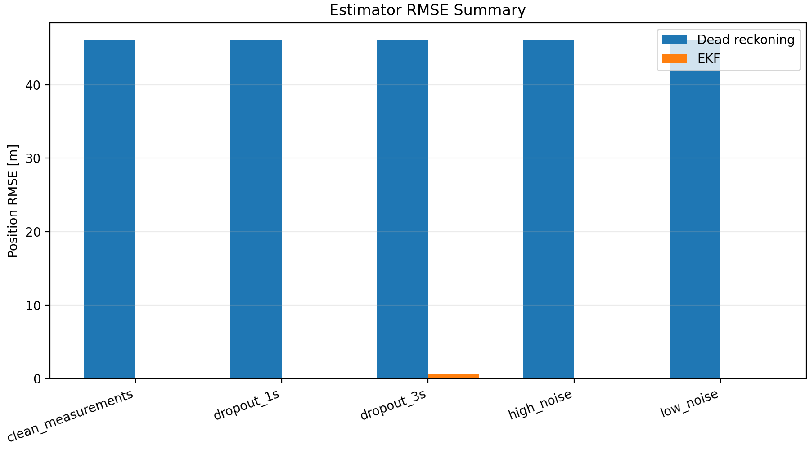

# The F1TENTH Gym environment

This is the repository of the F1TENTH Gym environment.

## Results Gallery

This fork is an offline modeling, identification, and control study built on F1TENTH/RoboRacer Gym. Every figure and number below is generated by the scripts in `experiments/`, written to `runs/`, and summarized in `reports/`. **All results are simulation-vs-simulation; no physical RoboRacer car has been built or tested.** The full report is in [`reports/final_report.md`](reports/final_report.md); the per-item action log is in [`GitHub Review Items/README.md`](GitHub%20Review%20Items/README.md).

### Headline results (honest)

- **Pure pursuit is the tracking baseline to beat — and the model-based controllers do not beat it.** On the same map, integration timestep (RK4, `dt = 0.002 s`), and 100 Hz zero-order-held update rate, tuned pure pursuit attains the **lowest RMS cross-track error (0.157892 m)** and the **lowest steering effort (8.19853 rad)**. LQR (0.178628 m) and MPC (0.169238 m) are both worse on tracking. See [`reports/controller_comparison.md`](reports/controller_comparison.md).
- **MPC's justification is constraint handling and a measured runtime guarantee, not accuracy.** The constrained SLSQP MPC enforces steering-angle / steering-rate / acceleration limits and meets a 100 Hz real-time budget at **p95 solve time 1.32644 ms** (mean 1.0739 ms), while its RMS CTE is still above pure pursuit. The max solve time can still spike to ~36.8 ms, above a single 10 ms control period — flagged as a deployment risk. See [`reports/mpc_controller.md`](reports/mpc_controller.md).
- **The dynamic single-track lateral coefficients are identified and pass an independent held-out replay.** `C_Sf` and `C_Sr` are recovered from controlled Gym excitation and validated on a chronologically held-out 30% split: held-out yaw-rate **VAF 100.000%** (RMSE 3.03e-10 rad/s), held-out slip-angle **VAF 100.000%** (RMSE 2.88e-10 rad), normalized-residual Jacobian condition number 1.340. This is a **simulator-recovery** result, not physical-vehicle validation. See [`reports/dynamic_parameter_identification.md`](reports/dynamic_parameter_identification.md).
- **The EKF recovers from injected noise and measurement dropout where dead reckoning diverges.** Against a dead-reckoning baseline that drifts to a 46.10 m position RMSE, the EKF holds 0.00397 m (clean), 0.0527 m (high-noise), 0.134 m (1 s dropout), and 0.706 m (3 s dropout). See [`reports/ekf_study.md`](reports/ekf_study.md).
- **The identification only stays credible up to modest data degradation; latency is the dominant failure path.** Under injected noise/latency/quantization, the `C_Sf`/`C_Sr` fit first fails acceptance at `noise_medium` (gate `heldout_yaw_rate`); a 20 ms input latency already drives `C_Sf` relative error to ~0.44. See [`reports/parameter_id_robustness.md`](reports/parameter_id_robustness.md).

### Figures

| | |
| --- | --- |
|  | **Pure pursuit tuning sweep (RMS CTE).** Selecting the lookahead = 1.2 m, vgain = 1.2 baseline that gives the lowest-cross-track-error stable lap (0.157892 m) used as the comparison reference for LQR and MPC. ([`reports/pure_pursuit_sweep.md`](reports/pure_pursuit_sweep.md)) |
|  | **MPC solver runtime vs real-time budget.** p95 solve time 1.32644 ms clears the 100 Hz (10 ms) budget; rare spikes to ~36.8 ms are the documented deployment risk. MPC earns its place on constraints + timing, not tracking accuracy. ([`reports/mpc_controller.md`](reports/mpc_controller.md)) |
|  | **EKF vs dead reckoning, position RMSE.** EKF stays sub-metre across clean / high-noise / 1 s / 3 s-dropout scenarios while dead reckoning diverges to 46.10 m. ([`reports/ekf_study.md`](reports/ekf_study.md)) |
|  | **Sim-to-real bridge: parameter-ID degradation under input latency.** The held-out fit first breaks at `noise_medium`, and input latency is the dominant failure mode for `C_Sf`/`C_Sr` recovery — the headline caution for trusting any real-bag fit. ([`reports/parameter_id_robustness.md`](reports/parameter_id_robustness.md)) |

A parallel, **design-only** Vehicle Design Package (no fabrication) is scaffolded in [`docs/design/`](docs/design/) — requirements/architecture, chassis/drivetrain/actuators, sensor/compute/power, and the mechanical design + FEA centerpiece — because NYU has no RoboRacer car and the physical path must be designed from scratch.

## Project Modeling Workflow

This fork keeps F1TENTH Gym as the offline modeling and validation baseline:

```text
Gym experiment
-> CSV telemetry
-> kinematic/dynamic replay
-> validation metrics
-> reports and figures
```

The current modeling work includes integrator comparison, vehicle-model derivation, kinematic replay, known-parameter dynamic replay, SysID steering excitation, held-out identification of Gym's nonlinear `C_Sf` and `C_Sr` coefficients, and controller studies for pure pursuit, LQR, and constrained MPC.

Run and validate the controlled Gym parameter identification:

```bash
python experiments/fit_dynamic_parameters.py
python experiments/validate_dynamic_parameter_identification.py
```

The fitting report is at `reports/dynamic_parameter_identification.md`. Controller reports are at `reports/pure_pursuit_sweep.md`, `reports/lqr_controller.md`, `reports/mpc_controller.md`, and `reports/controller_comparison.md`. Estimation and robustness reports are at `reports/ekf_study.md`, `reports/failure_mode_fmea.md`, and `reports/parameter_id_robustness.md`. A physical RoboRacer vehicle requires its own excitation dataset and held-out validation before its identified parameters are accepted.

## ROS 2 / RoboRacer Compatibility

RoboRacer is the current continuation of the F1TENTH ecosystem. This repository adds a ROS 2 sidecar package at:

```text
ros2_ws/src/f1tenth_modeling
```

Build from a ROS 2 environment:

```bash
cd ros2_ws
colcon build --symlink-install
source install/setup.bash
```

Run the ROS 2 Gym bridge and SysID excitation node:

```bash
ros2 launch f1tenth_modeling sysid_excitation.launch.py
```

Convert a ROS 2 bag using standard RoboRacer-style topics:

```bash
python experiments/rosbag_to_telemetry.py \
  --bag path/to/rosbag \
  --output runs/ros2_sysid_steering_excitation/telemetry.csv \
  --metadata runs/ros2_sysid_steering_excitation/metadata.json \
  --quality runs/ros2_sysid_steering_excitation/quality_metrics.csv
```

Validate the converted telemetry:

```bash
python experiments/validate_sysid_excitation.py \
  --telemetry runs/ros2_sysid_steering_excitation/telemetry.csv \
  --quality runs/ros2_sysid_steering_excitation/quality_metrics.csv
```

The converter uses `/ego_racecar/odom` and `/drive` as the primary standard topics. The project-specific `/f1tenth/internal_state` topic is optional enrichment for achieved steering and slip angle.

Item 11 ROS-backed validation results are in [`evidence/item11/report.md`](evidence/item11/report.md). The enriched bridge recovered Gym's known lateral coefficients from native achieved-state samples, while stock `f1tenth_gym_ros` was intentionally limited to a standard-topic ingestion claim because it does not expose achieved steering.

Verified ROS 2 environment guides:

- [RoboStack Humble on macOS](docs/ros2_verification_robostack_macos.md)
- [Official ROS 2 Humble on Ubuntu 22.04](docs/ros2_verification_ubuntu_humble.md)
- [Environment comparison and switching guide](docs/ros2_verification_summary.md)

This project is still under heavy development.

You can find the [documentation](https://f1tenth-gym.readthedocs.io/en/latest/) of the environment here.

## Quickstart
We recommend installing the simulation inside a virtualenv. You can install the environment by running:

```bash
virtualenv gym_env
source gym_env/bin/activate
git clone https://github.com/f1tenth/f1tenth_gym.git
cd f1tenth_gym
pip install -e .
```

Then you can run a quick waypoint follow example by:
```bash
cd examples
python3 waypoint_follow.py
```

A Dockerfile is also provided with support for the GUI with nvidia-docker (nvidia GPU required):
```bash
docker build -t f1tenth_gym_container -f Dockerfile .
docker run --gpus all -it -e DISPLAY=$DISPLAY -v /tmp/.X11-unix:/tmp/.X11-unix f1tenth_gym_container
````
Then the same example can be ran.

## Known issues
- Library support issues on Windows. You must use Python 3.8 as of 10-2021
- On MacOS Big Sur and above, when rendering is turned on, you might encounter the error:
```
ImportError: Can't find framework /System/Library/Frameworks/OpenGL.framework.
```
You can fix the error by installing a newer version of pyglet:
```bash
$ pip3 install pyglet==1.5.20
```
And you might see an error similar to
```
f110-gym 0.2.1 requires pyglet<1.5, but you have pyglet 1.5.20 which is incompatible.
```
which could be ignored. The environment should still work without error.

## Citing
If you find this Gym environment useful, please consider citing:

```
@inproceedings{okelly2020f1tenth,
  title={F1TENTH: An Open-source Evaluation Environment for Continuous Control and Reinforcement Learning},
  author={O’Kelly, Matthew and Zheng, Hongrui and Karthik, Dhruv and Mangharam, Rahul},
  booktitle={NeurIPS 2019 Competition and Demonstration Track},
  pages={77--89},
  year={2020},
  organization={PMLR}
}
```
