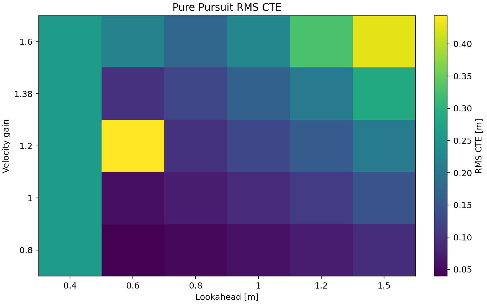
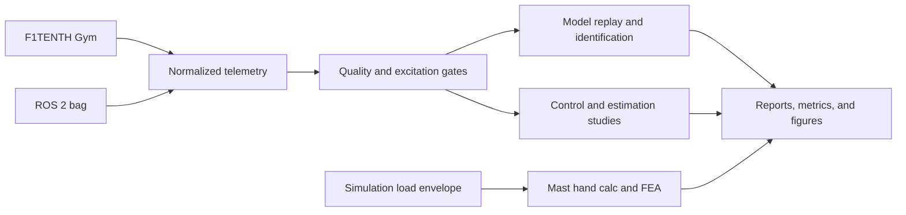

# RoboRacer Modeling, Controls, and Mechanical Design

[](https://github.com/500ft/RoboRacer/actions/workflows/ci.yml)
[](https://github.com/500ft/RoboRacer/actions/workflows/docker.yml)
[](LICENSE)

A Python and ROS 2 suite for autonomous-racing dynamics, system identification,
control, state estimation, telemetry analysis, and LiDAR-mast design.

**[Results](reports/final_report.md) · [Reproduce](#reproduce-the-study) · [Data and figures](docs/data-and-figures.md) · [ROS 2](#ros-2-workflow)**



*Pure-pursuit tracking error across the tested lookahead and velocity-gain
grid. The [final report](reports/final_report.md) contains results and the
[figure guide](docs/data-and-figures.md) traces each plot to code and inputs.*

## Overview

The repository provides a repeatable path from F1TENTH Gym or ROS 2 telemetry
to model checks, parameter fits, controller and estimator comparisons, and
engineering reports. A parallel mechanical lane evaluates a LiDAR mast with
hand calculations and FEA.


```mermaid
flowchart LR
    S[F1TENTH Gym] --> T[Normalized telemetry]
    R[ROS 2 bag] --> T
    T --> Q[Quality and excitation gates]
    Q --> M[Model replay and identification]
    Q --> C[Control and estimation studies]
    M --> O[Reports, metrics, and figures]
    C --> O
    L[Simulation load envelope] --> D[Mast hand calc and FEA]
    D --> O
```

Most vehicle results are simulation outputs. The enriched ROS 2 regression
captures exercise the telemetry path but are not physical vehicle tests. Mast
results are calculations and FEA; the physical compliance campaign is pending.

## Reproduce the study

The legacy Gym stack is pinned to Python 3.9 and older numerical packages:

```bash
conda env create -f environment.yml
conda activate f1tenth-gym
python -m pip install -e .
./run_all.sh
```

Longer controller and robustness studies are opt-in:

```bash
RUN_FULL_MPC=1 RUN_ROBUSTNESS=1 ./run_all.sh
```

For the portable report and telemetry regression checks used by CI:

```bash
python -m pip install -r requirements-item11-regression.txt
python -m pip install -r requirements-report.txt
PYTHONPATH=gym python experiments/test_final_report.py
```

Each figure group, its direct input artifacts, and its standalone command are
listed in [`docs/data-and-figures.md`](docs/data-and-figures.md). The full chain
can take longer than the portable CI checks and requires the pinned Gym
environment.

## ROS 2 workflow

The sidecar package is in `ros2_ws/src/f1tenth_modeling` and uses standard
odometry and drive topics, with `/f1tenth/internal_state` as optional simulator
enrichment.

```bash
cd ros2_ws
colcon build --symlink-install
source install/setup.bash
ros2 launch f1tenth_modeling sysid_excitation.launch.py
```

Convert a bag into the shared telemetry schema:

```bash
python experiments/rosbag_to_telemetry.py \
  --bag path/to/rosbag \
  --output runs/ros2_sysid_steering_excitation/telemetry.csv \
  --metadata runs/ros2_sysid_steering_excitation/metadata.json \
  --quality runs/ros2_sysid_steering_excitation/quality_metrics.csv
```

See the setup notes for
[`macOS`](docs/ros2_verification_robostack_macos.md) and
[`Ubuntu 22.04`](docs/ros2_verification_ubuntu_humble.md).

## Documentation

| Document | Purpose |
| --- | --- |
| [`reports/final_report.md`](reports/final_report.md) | Integrated modeling, controls, estimation, and mast results |
| [`docs/data-and-figures.md`](docs/data-and-figures.md) | Evidence classes, data flow, plot generators, inputs, and commands |
| [`docs/figure-manifest.json`](docs/figure-manifest.json) | Machine-readable generator/input/output map |
| [`docs/vehicle_model.md`](docs/vehicle_model.md) | Vehicle equations and assumptions |
| [`docs/telemetry_data_dictionary.md`](docs/telemetry_data_dictionary.md) | Shared telemetry schema |
| [`docs/parameter_inventory.md`](docs/parameter_inventory.md) | Parameter sources and status |
| [`reports/controller_comparison.md`](reports/controller_comparison.md) | Pure pursuit, LQR, and MPC comparison |
| [`reports/ekf_study.md`](reports/ekf_study.md) | Estimation noise and dropout study |
| [`docs/design/`](docs/design/) | Mechanical requirements, analysis, and FEA setup |
| [`docs/specs/mast-physical-validation/`](docs/specs/mast-physical-validation/) | Frozen compliance-test protocol |

## Repository map

```text
gym/          F1TENTH simulator package
experiments/  simulation, telemetry, controls, estimation, and mast scripts
runs/         generated telemetry, metrics, parameters, and solver summaries
reports/      study reports and result figures
ros2_ws/      ROS 2 telemetry and excitation sidecar
evidence/     portable ROS-backed regression captures
docs/         models, schemas, setup notes, designs, and figure lineage
```

## Compatibility

- Use `environment.yml` for the legacy Gym simulator.
- GUI rendering requires OpenGL; headless experiments and report checks do not.
- Keep ROS 2 dependencies separate from the legacy Gym environment.

## Citation and license

The simulator lineage and source references are documented in
[`docs/upstream_roboracer_sources.md`](docs/upstream_roboracer_sources.md).
This repository is available under the [MIT License](LICENSE).

See [`CONTRIBUTING.md`](CONTRIBUTING.md) before changing generated artifacts or
portable regression evidence.
