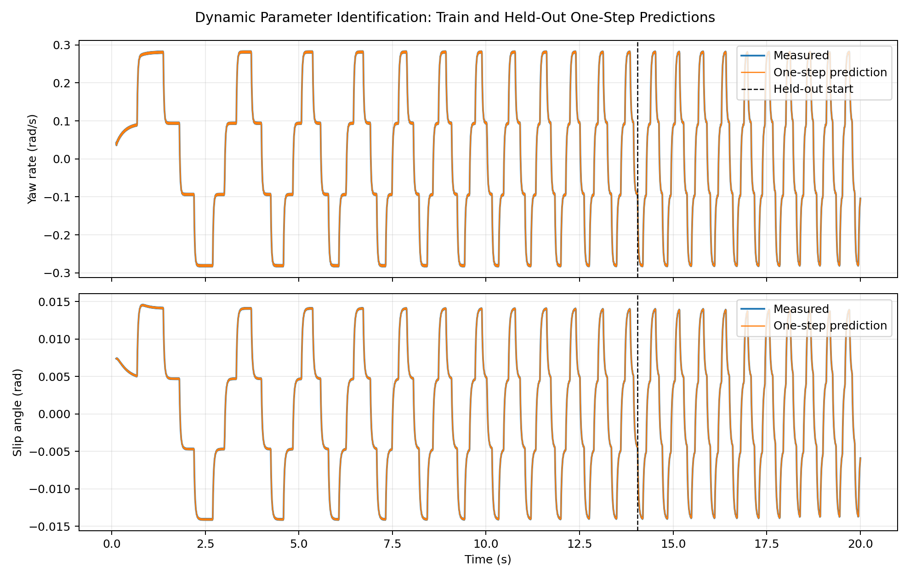
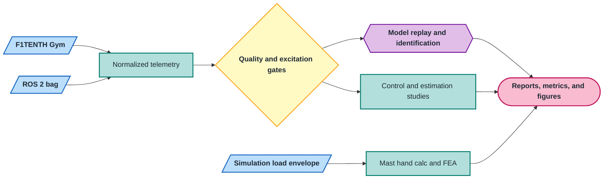

# RoboRacer Modeling, Controls, and Mechanical Design

CAD development is now broken into [individual work orders](docs/CAD_PLAN.md) and a [CAD task ledger](docs/CAD_TASKS.csv). These are planned models, fixtures and release drawings—not completed CAD or hardware evidence.

**A Python and ROS 2 suite for autonomous-racing dynamics, system
identification, control, state estimation, telemetry analysis, and LiDAR-mast
design.**

[](https://github.com/500ft/RoboRacer/actions/workflows/ci.yml)
[](https://github.com/500ft/RoboRacer/actions/workflows/docker.yml)
[](LICENSE)

**[Results](reports/final_report.md) · [Reproduce](#reproduce-the-study) · [Data and figures](docs/data-and-figures.md) · [ROS 2](#ros-2-workflow)**



*One-step yaw-rate and slip-angle predictions of the identified dynamic
bicycle model against F1TENTH Gym telemetry, with the held-out validation
segment right of the dashed line. Evidence state: simulation. Details in
[`reports/dynamic_parameter_identification.md`](reports/dynamic_parameter_identification.md);
the [figure guide](docs/data-and-figures.md) traces each plot to code and
inputs.*

## Overview

The repository provides a repeatable path from F1TENTH Gym or ROS 2 telemetry
to model checks, parameter fits, controller and estimator comparisons, and
engineering reports. A parallel mechanical lane evaluates a LiDAR mast with
hand calculations and FEA.


```mermaid
flowchart LR
    classDef input    fill:#bbdefb,stroke:#1565c0,stroke-width:2px,color:#1f2933,font-weight:bold;
    classDef process  fill:#b2dfdb,stroke:#00796b,stroke-width:2px,color:#1f2933;
    classDef core     fill:#e1bee7,stroke:#7b1fa2,stroke-width:2px,color:#1f2933,font-weight:bold;
    classDef decision fill:#fff9c4,stroke:#f9a825,stroke-width:2px,color:#1f2933,font-weight:bold;
    classDef endpoint fill:#f8bbd0,stroke:#c2185b,stroke-width:2px,color:#1f2933,font-weight:bold;

    S[/F1TENTH Gym/]:::input --> T[Normalized telemetry]:::process
    R[/ROS 2 bag/]:::input --> T
    T --> Q{Quality and excitation gates}:::decision
    Q --> M{{Model replay and identification}}:::core
    Q --> C[Control and estimation studies]:::process
    M --> O([Reports, metrics, and figures]):::endpoint
    C --> O
    L[/Simulation load envelope/]:::input --> D[Mast hand calc and FEA]:::process
    D --> O
```

*Shapes: parallelogram = input · rectangle = process · diamond = gate · hexagon = core method · pill = endpoint.*

Most vehicle results are simulation outputs. The enriched ROS 2 regression
captures exercise the telemetry path but are not physical vehicle tests. Mast
results are calculations and FEA; the physical compliance campaign is pending.

## Reproduce the study

The legacy Gym stack is pinned to Python 3.9 and older numerical packages:

```bash
conda env create -f environment.yml
conda activate f1tenth-gym
python -m pip install -e .
./run_all.sh
```

Longer controller and robustness studies are opt-in:

```bash
RUN_FULL_MPC=1 RUN_ROBUSTNESS=1 ./run_all.sh
```

For the portable report and telemetry regression checks used by CI:

```bash
python -m pip install -r requirements-item11-regression.txt
python -m pip install -r requirements-report.txt
PYTHONPATH=gym python experiments/test_final_report.py
```

Each figure group, its direct input artifacts, and its standalone command are
listed in [`docs/data-and-figures.md`](docs/data-and-figures.md). The full chain
can take longer than the portable CI checks and requires the pinned Gym
environment.

## ROS 2 workflow

The sidecar package is in `ros2_ws/src/f1tenth_modeling` and uses standard
odometry and drive topics, with `/f1tenth/internal_state` as optional simulator
enrichment.

```bash
cd ros2_ws
colcon build --symlink-install
source install/setup.bash
ros2 launch f1tenth_modeling sysid_excitation.launch.py
```

Convert a bag into the shared telemetry schema:

```bash
python experiments/rosbag_to_telemetry.py \
  --bag path/to/rosbag \
  --output runs/ros2_sysid_steering_excitation/telemetry.csv \
  --metadata runs/ros2_sysid_steering_excitation/metadata.json \
  --quality runs/ros2_sysid_steering_excitation/quality_metrics.csv
```

See the setup notes for
[`macOS`](docs/ros2_verification_robostack_macos.md) and
[`Ubuntu 22.04`](docs/ros2_verification_ubuntu_humble.md).

## Documentation

| Document | Purpose |
| --- | --- |
| [`reports/final_report.md`](reports/final_report.md) | Integrated modeling, controls, estimation, and mast results |
| [`docs/data-and-figures.md`](docs/data-and-figures.md) | Evidence classes, data flow, plot generators, inputs, and commands |
| [`docs/figure-manifest.json`](docs/figure-manifest.json) | Machine-readable generator/input/output map |
| [`docs/vehicle_model.md`](docs/vehicle_model.md) | Vehicle equations and assumptions |
| [`docs/telemetry_data_dictionary.md`](docs/telemetry_data_dictionary.md) | Shared telemetry schema |
| [`docs/parameter_inventory.md`](docs/parameter_inventory.md) | Parameter sources and status |
| [`reports/controller_comparison.md`](reports/controller_comparison.md) | Pure pursuit, LQR, and MPC comparison |
| [`reports/ekf_study.md`](reports/ekf_study.md) | Estimation noise and dropout study |
| [`docs/design/`](docs/design/) | Mechanical requirements, analysis, and FEA setup |
| [`docs/specs/mast-physical-validation/`](docs/specs/mast-physical-validation/) | Frozen compliance-test protocol |

## Repository map

```text
gym/          F1TENTH simulator package
experiments/  simulation, telemetry, controls, estimation, and mast scripts
runs/         generated telemetry, metrics, parameters, and solver summaries
reports/      study reports and result figures
ros2_ws/      ROS 2 telemetry and excitation sidecar
evidence/     portable ROS-backed regression captures
docs/         models, schemas, setup notes, designs, and figure lineage
```

## Status and roadmap

Done (evidence state: simulation):

- System identification of the dynamic bicycle model with a held-out
  validation segment
  ([`reports/dynamic_parameter_identification.md`](reports/dynamic_parameter_identification.md)),
  plus noise robustness
  ([`reports/parameter_id_robustness.md`](reports/parameter_id_robustness.md)).
- RK4/Euler integrator convergence study
  ([`reports/integrator_convergence.md`](reports/integrator_convergence.md))
  and kinematic-model replay comparison
  ([`reports/model_vs_gym_comparison.md`](reports/model_vs_gym_comparison.md)).
- Pure pursuit, LQR, and MPC comparison
  ([`reports/controller_comparison.md`](reports/controller_comparison.md)),
  EKF study ([`reports/ekf_study.md`](reports/ekf_study.md)), and failure-mode
  FMEA ([`reports/failure_mode_fmea.md`](reports/failure_mode_fmea.md)).
- ROS 2 bag-to-telemetry bridge with portable regression evidence
  ([`evidence/item11/report.md`](evidence/item11/report.md)) — simulator-backed
  captures, not physical vehicle tests.

Done (evidence state: hand calculation and FEA):

- LiDAR-mast load case, hand calculations, static FEA, mesh convergence, and
  modal analysis ([`docs/design/16_mechanical_design_analysis.md`](docs/design/16_mechanical_design_analysis.md)).

Pending:

- [Evidence-integrity sprint](docs/SPRINT_ROADMAP.md): the mast evaluator now
  requires a complete paired trial matrix and traceable campaign/reference
  artifacts. Synthetic checks are labeled `SIMULATED_AGREEMENT`, never physical
  validation; [review evidence](docs/REVIEW_READY.md) distinguishes software
  results from the still-pending apparatus.

- Physical mast compliance measurement. The FEA-predicted tip deflection
  (0.176 mm at the committed load case) has not been measured; the frozen
  test protocol is in
  [`docs/specs/mast-physical-validation/`](docs/specs/mast-physical-validation/).
- Parametric CAD for the mast and deck interface (analyses use idealized tube
  geometry).
- No physical-vehicle telemetry result is present.

## Compatibility

- Use `environment.yml` for the legacy Gym simulator.
- GUI rendering requires OpenGL; headless experiments and report checks do not.
- Keep ROS 2 dependencies separate from the legacy Gym environment.

## Citation and license

The simulator lineage and source references are documented in
[`docs/upstream_roboracer_sources.md`](docs/upstream_roboracer_sources.md).
This repository is available under the [MIT License](LICENSE).

See [`CONTRIBUTING.md`](CONTRIBUTING.md) before changing generated artifacts or
portable regression evidence.
