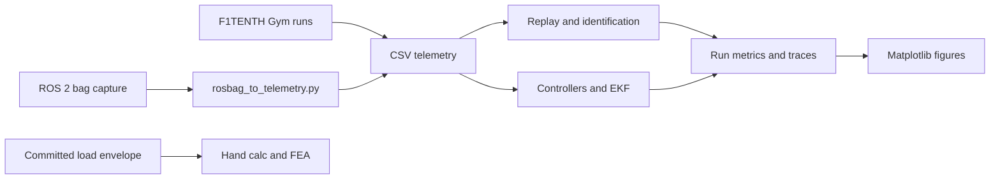

# Data and figure production

This guide connects each result plot to its generator, immediate data inputs,
and evidence class. Detailed interpretation belongs in the linked reports.



## Evidence classes

| Class | Scope |
| --- | --- |
| Simulator output | Telemetry and metrics produced by the F1TENTH Gym workflows |
| Simulator-backed ROS 2 capture | Bag-derived telemetry recorded through ROS 2 interfaces with optional Gym internal-state enrichment |
| Software timing | Solver runtime measured on the machine that generated the committed result; not a hardware real-time guarantee |
| Hand calculation | Closed-form mast and tolerance calculations from stated geometry and loads |
| FEA | CalculiX results using the geometry, mesh, material, and boundary conditions in `docs/design/FEA_SETUP.md` |
| Physical test | No accepted physical vehicle or mast result is currently present |

## Full reproduction

From the pinned `f1tenth-gym` environment:

```bash
./run_all.sh
RUN_FULL_MPC=1 RUN_ROBUSTNESS=1 ./run_all.sh
```

`run_all.sh` establishes dependency order. It first generates the scripted lap,
then runs numerical convergence, model replay, excitation and parameter fitting,
controller studies, EKF cases, and the optional robustness work. Individual
commands below are useful when updating one report.

## Numerical integration and replay

| Figure group | Generator | Immediate input | Command |
| --- | --- | --- | --- |
| Euler/RK4 comparison, trajectories, tracking error, summary table | `experiments/plot_integrator_comparison.py` | `runs/first_lap/telemetry.csv` | `python experiments/run_scripted_lap.py && python experiments/plot_integrator_comparison.py` |
| RK4 convergence error and metrics | `experiments/integrator_convergence.py` | Scripted simulations at each encoded timestep | `python experiments/integrator_convergence.py` |
| Dynamic replay yaw and state error | `experiments/dynamic_model_replay.py` | `runs/first_lap/telemetry.csv` | `python experiments/dynamic_model_replay.py` |
| Kinematic replay trajectory and state error | `experiments/model_vs_gym_comparison.py` | `runs/first_lap/telemetry.csv` | `python experiments/model_vs_gym_comparison.py` |

`reports/figures/kinematic_yaw_rate_diagnostic.png` is cited by the kinematic
report, but the current generator writes only the trajectory and state-error
figures. No reproducible generator for the diagnostic image is present. The
manifest records it as a legacy artifact with a missing generation step.

## System identification

| Figure group | Generator | Immediate input | Command |
| --- | --- | --- | --- |
| Steering excitation, yaw response, speed hold | `experiments/sysid_steering_excitation.py` | Script-defined chirp and F1TENTH Gym | `python experiments/sysid_steering_excitation.py` |
| Parameter fit and held-out residuals | `experiments/fit_dynamic_parameters.py` | `runs/sysid_steering_excitation/telemetry.csv` | `python experiments/fit_dynamic_parameters.py` |
| Noise, latency, and conditioning degradation | `experiments/parameter_id_robustness.py` | Excitation telemetry plus encoded perturbation grid | `python experiments/parameter_id_robustness.py` |

The fitter uses the first 70% of usable dynamic-regime intervals for training
and the final 30% for held-out replay. The default `--oracle gym` mode may use
logged Gym internal states; that makes the default fit a simulator-recovery
test, not physical system identification.

## Controllers and state estimation

| Figure group | Generator | Immediate input | Command |
| --- | --- | --- | --- |
| Pure-pursuit error, lap-time, and region sweeps | `experiments/pure_pursuit_sweep.py` | Script-defined parameter grid and simulator | `python experiments/pure_pursuit_sweep.py` |
| LQR tracking cases | `experiments/lqr_controller.py` | `runs/pure_pursuit_sweep/results.csv` | `python experiments/lqr_controller.py` |
| MPC timing and tracking cases | `experiments/mpc_controller.py` | `runs/pure_pursuit_sweep/results.csv` | `python experiments/mpc_controller.py` |
| EKF error, RMSE, and dropout zoom | `experiments/ekf_study.py` | Tuned pure-pursuit selection and encoded sensor cases | `python experiments/ekf_study.py` |
| FMEA scores and detection signals | `experiments/failure_mode_fmea.py` | Pure-pursuit and EKF results | `python experiments/failure_mode_fmea.py` |

Controller comparisons use the same simulator and track assumptions. MPC timing
is machine-dependent; regenerate it on the intended compute platform before
using it as a deployment budget.

## ROS 2 regression evidence

`evidence/item11/telemetry/enriched_bridge.csv` is a normalized capture from the
ROS 2 sidecar path. The raw bag is not committed; its capture metadata and
recording command are in `evidence/item11/bags/MANIFEST.yaml`.

```bash
python experiments/item11_report.py
python experiments/fit_dynamic_parameters.py \
  --telemetry evidence/item11/telemetry/enriched_bridge.csv \
  --run-dir evidence/item11/metrics/enriched_identification \
  --report evidence/item11/enriched_identification.md \
  --figure-dir evidence/item11/figures \
  --figure-prefix enriched_ros
```

The first command creates the steering command/achieved plot. The second creates
the enriched fit and residual figures from the committed normalized telemetry.
These artifacts validate conversion and analysis interfaces; they do not
represent a physical RoboRacer experiment.

## Mechanical outputs

The final report also uses text outputs rather than plot images:

```bash
python experiments/mast_hand_calc.py
python experiments/mast_tolerance_stack.py
python experiments/test_mast_physical_validation.py
```

Committed hand-calculation summaries are in `runs/mast_hand_calc/` and
`runs/mast_tolerance_stack/`. FEA summaries are in `runs/mast_fea/`; the exact
gmsh and CalculiX process is documented in
[`docs/design/FEA_SETUP.md`](design/FEA_SETUP.md). No physical compliance CSV
has passed the frozen acceptance protocol.

## Output policy

Reports under `reports/` are generated or assembled interpretations of the
`runs/` artifacts. `reports/figures/` contains publication outputs. Brand
assets under `docs/assets/` and map files are not study results and are
excluded from the manifest.

See [`figure-manifest.json`](figure-manifest.json) for the machine-readable
generator/input/output map.
