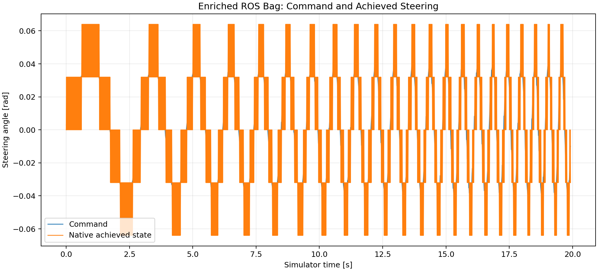

# Item 11: ROS-Backed Pipeline Validation

## Result

Two genuine ROS 2 middleware recordings passed their source-specific gates:

- The project bridge supplied native achieved steering and recovered Gym's known `C_Sf` and `C_Sr` through the complete bag-to-fit pipeline.
- Stock `f1tenth_gym_ros` at `883394df0964c555ee05bea69c3002daf6f2d405` supplied only `/ego_racecar/odom` and `/drive`; it passed ingestion and excitation checks and was not used for parameter identification.

Raw bags were validated locally through deterministic ZIP, SHA-256, reconversion, and byte-identical telemetry checks. Both bags are now published as GitHub release assets under tag [`v11-ros-bag`](https://github.com/500ft/RoboRacer/releases/tag/v11-ros-bag), and `bags/MANIFEST.yaml` records their byte-size and SHA-256 chain of custody (verify with `python experiments/bag_evidence.py verify <name>`).

## Enriched Identification

| Metric | Direct Gym | ROS-backed enriched |
| --- | ---: | ---: |
| `C_Sf` | 4.717999998 | 4.718000001 |
| `C_Sr` | 5.456200004 | 5.456200007 |
| Normalized Jacobian condition | 1.340 | 1.339 |
| Raw Jacobian condition | — | 2.949 |
| Parameter correlation | — | 0.091 |
| Held-out yaw-rate RMSE | 3.029e-10 rad/s | 2.986e-10 rad/s |

Primary held-out evidence duration was `5.97 s`. The `597` native transitions are bookkeeping, not a claim of independent statistical samples.

## Steering Observability

The simulator has a two-sample command buffer and a bang-bang steering controller. It commands `±3.2 rad/s` whenever steering error exceeds `1e-4 rad`; this is not a second-order physical actuator model.

- Command/achieved RMSE: `0.01942 rad`
- Maximum absolute difference: `0.04400 rad`
- Best command shift: `2` samples (`0.020 s`)
- RMSE after that shift: `0.01887 rad`
- Achieved transitions at the rate limit: `99.55%`

The fit uses the raw native achieved state without smoothing or upsampling. This demonstrates correct transport and consumption of an achieved-steering channel in simulation; it does not validate a physical actuator.



## Timing and Topic Quality

| Source | Overlap | RTF | State/odom rate | Steering source | Collision |
| --- | ---: | ---: | ---: | --- | --- |
| Enriched bridge | 19.94 s | 0.9995 | 100.0 Hz | internal state | observed false |
| Stock upstream | 19.91 s | 0.9998 | 251.8 Hz | command proxy | unobserved |

The enriched RTF comes from published simulator time. Upstream publishes odometry at 250 Hz while stepping Gym at 100 Hz, so its RTF proxy counts odometry state changes and multiplies by the audited 0.01 s simulation step. Its realized simulator-time chirp band was `0.200–2.000 Hz`.

## Upstream Contract

All upstream gates use only odometry and drive data:

- command steering range: `0.0800 rad`;
- yaw-rate response range: `0.5672 rad/s`;
- speed coefficient of variation and topic timing from odometry;
- collision explicitly remains unobserved.

No upstream parameter fit is reported because achieved steering is unavailable.

## Reproduction

```bash
# Enriched capture
ros2 launch f1tenth_modeling item11_enriched_capture.launch.py
python experiments/rosbag_to_telemetry.py --bag <enriched-bag> \
  --output evidence/item11/telemetry/enriched_bridge.csv \
  --metadata evidence/item11/metrics/enriched_conversion_metadata.json \
  --quality evidence/item11/metrics/enriched_quality.csv \
  --sample-clock internal_state

# Stock upstream capture after sourcing the pinned upstream workspace
ros2 launch f1tenth_modeling item11_upstream_capture.launch.py
python experiments/rosbag_to_telemetry.py --bag <upstream-bag> \
  --output evidence/item11/telemetry/upstream_gym_ros.csv \
  --metadata evidence/item11/metrics/upstream_conversion_metadata.json \
  --quality evidence/item11/metrics/upstream_quality.csv \
  --sample-clock odom --sim-step-dt 0.01 \
  --command-frequency-start 0.2 --command-frequency-end 2.0
```

## Scope

This is a controlled simulator-recovery and ROS-ingestion result. Physical `C_Sf`/`C_Sr`, actuator dynamics, and controller retuning remain gated on a calibrated hardware bag.
