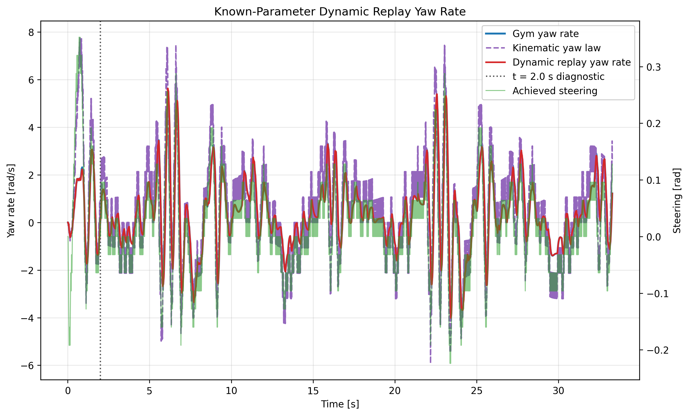
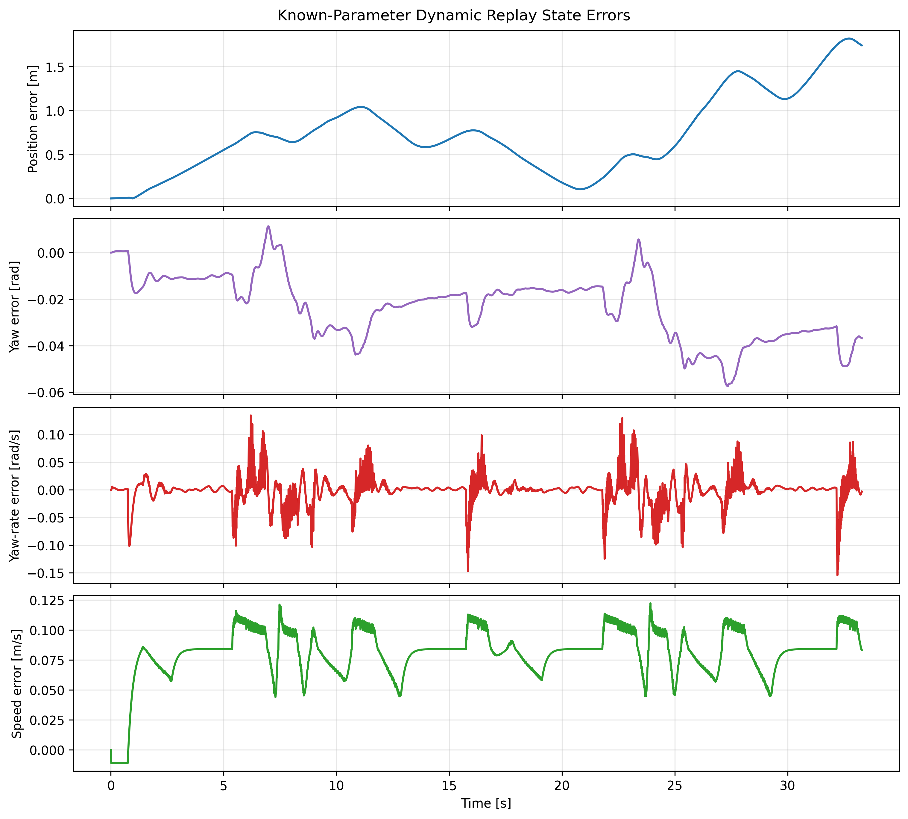

# Known-Parameter Dynamic Model Replay

## Objective

Test whether Gym's nonlinear single-track model structure can reproduce the yaw-rate behavior that the kinematic replay could not.

## Model Source

This replay uses Gym's known nonlinear single-track parameters as an oracle/reference case. It is not system identification. The purpose is to test whether the dynamic model structure and state/input convention reproduce the yaw-rate behavior that the kinematic replay could not.

- Model function: `vehicle_dynamics_st`
- Model source: `gym/f110_gym/envs/dynamic_models.py`
- Parameter source: `gym/f110_gym/envs/f110_env.py`

## Parameters

The replay uses the default nonlinear single-track parameters recorded in `docs/parameter_inventory.md`.

## Inputs

- Telemetry: `runs/first_lap/telemetry.csv`
- Integrator filtered: `rk4`
- State order: `[x, y, steer_angle, speed, yaw, yaw_rate, slip_angle]`
- Input order: `[steering_velocity, longitudinal_acceleration]`
- Steering velocity: reconstructed from achieved `steer_rad` by forward difference over each interval
- Longitudinal acceleration: `accel_x_mps2`

## Method

The state is initialized from the first RK4 telemetry row. The replay then integrates `vehicle_dynamics_st` with RK4 over each logged telemetry interval and compares the propagated state at row `k+1` against telemetry row `k+1`.

## Results

| Metric | Value | Units |
| --- | ---: | --- |
| RMSE position | 0.844155 | m |
| Max position error | 1.81909 | m |
| Final position error | 1.74165 | m |
| RMSE yaw | 0.0270263 | rad |
| RMSE yaw rate | 0.0263791 | rad/s |
| Max abs yaw-rate error | 0.154487 | rad/s |
| Final yaw-rate error | -0.00308012 | rad/s |
| RMSE speed | 0.0841688 | m/s |
| Number of samples | 3329 | count |
| Duration | 33.28 | s |

## Comparison Against Kinematic Replay

| Metric | Value | Units |
| --- | ---: | --- |
| Kinematic yaw-rate RMSE | 1.32389 | rad/s |
| Dynamic yaw-rate RMSE | 0.0263791 | rad/s |
| Yaw-rate RMSE improvement | 98.0075 | % |

## Figures

## Limitations

The initial slip angle is set to zero because slip angle is not available in the current telemetry. This can introduce an initial transient, so early-time dynamic replay error should not be interpreted as tire-parameter error.

The replay uses logged longitudinal acceleration as the best available input proxy. That signal may not be the exact constrained acceleration used internally during the original Gym integration, so residual drift should be interpreted as replay/input-reconstruction error before treating it as model-structure error.

This is not parameter identification, not controller design, and not proof that fitted dynamic parameters have been recovered.

## Next Step

Use this oracle replay to decide the first system-identification experiment. The next sysID branch should excite steering and fit dynamic tire parameters only after the known-parameter replay path is accepted.
