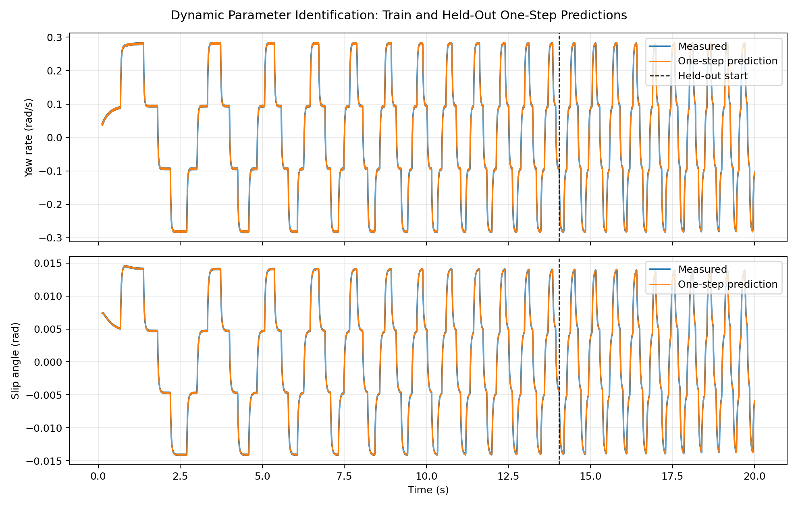
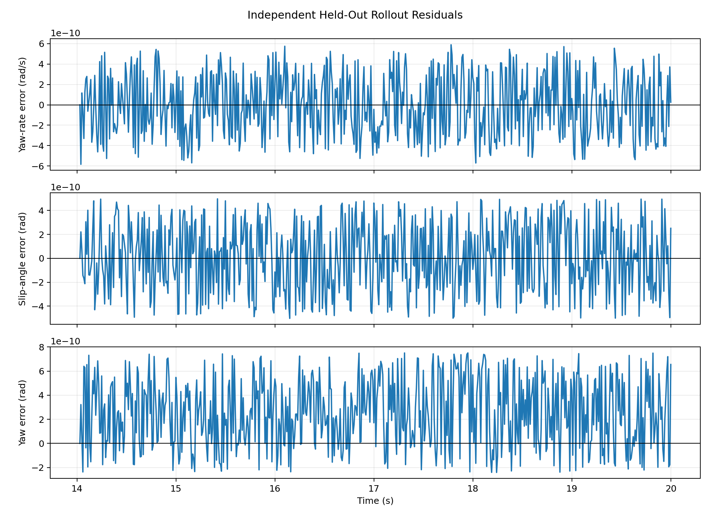

# Dynamic Parameter Identification

## Objective

Estimate Gym nonlinear single-track coefficients `C_Sf` and `C_Sr` from the validated steering-excitation dataset, then require an independent held-out replay to pass before any LQR, MPC, or controller tuning begins.

## Method

The fitter uses the logged internal states and achieved/reconstructed inputs from `runs/sysid_steering_excitation/telemetry.csv`. Only intervals starting at `speed_mps >= 0.75` are used, excluding Gym's low-speed kinematic fallback. The first 70% of usable intervals are training data; the final 30% are held out chronologically.

For each training interval, the measured state at row `k` is propagated one RK4 step through `vehicle_dynamics_st`. The achieved finite-difference inputs stored on row `k+1` are applied over interval `k -> k+1`. Bounded nonlinear least squares minimizes normalized yaw-rate and slip-angle one-step residuals. The held-out rollout starts once from the measured split state and then propagates recursively without state resets.

## Identified Parameters

| Parameter | Identified | Known Gym oracle | Relative error |
| --- | ---: | ---: | ---: |
| `C_Sf` | 4.717999998 | 4.718000000 | 5.197e-10 |
| `C_Sr` | 5.456200004 | 5.456200000 | 6.527e-10 |

The oracle values are used only because this excitation dataset was generated by Gym and therefore supports a controlled recovery check. A real RoboRacer bag will not have an oracle comparison.

## Held-Out Validation

Validation status: **passed**

| Metric | Value |
| --- | ---: |
| Held-out rollout yaw-rate RMSE | 3.028881e-10 rad/s |
| Held-out rollout yaw-rate NRMSE | 5.346680e-10 of measured range |
| Held-out rollout yaw-rate VAF | 100.000000000% |
| Held-out rollout slip-angle RMSE | 2.877898e-10 rad |
| Held-out rollout slip-angle NRMSE | 1.024499e-08 of measured range |
| Held-out rollout slip-angle VAF | 100.000000000% |
| Held-out rollout yaw RMSE | 3.846297e-10 rad |
| Held-out rollout position RMSE | 2.066940e-09 m |
| Normalized residual Jacobian condition number | 1.340140 |

Acceptance checks:

| Check | Pass |
| --- | --- |
| oracle_recovery | True |
| heldout_yaw_rate | True |
| heldout_slip_angle | True |
| heldout_yaw | True |
| heldout_normalized_fit | True |
| heldout_variance_accounted_for | True |
| identifiability | True |

## Figures

## Interpretation

The held-out validation demonstrates that the identified coefficients reproduce the nonlinear lateral-yaw state evolution for a frequency regime not used during fitting. The low Jacobian condition number indicates that the selected excitation distinguishes the two fitted coefficients for this controlled dataset.

This result validates the identification pipeline against Gym's known oracle. It does not establish that the same coefficients apply to a physical RoboRacer vehicle.

## Scope Gate

No LQR, MPC, or controller tuning is performed here. Controller design remains blocked until an identified model passes held-out validation. This Gym identification passes that gate for simulator work; physical-vehicle controller work still requires identification and held-out validation from real RoboRacer data.
