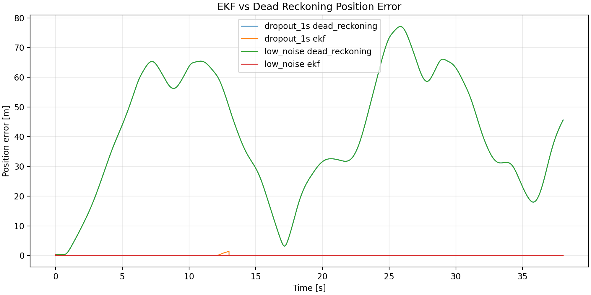
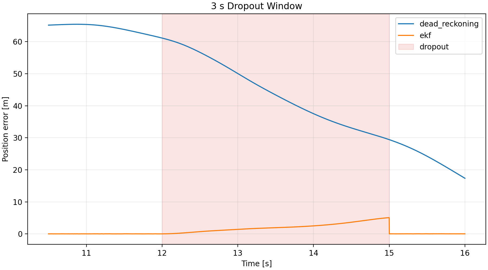

# EKF Study

## Objective

Compare dead reckoning and EKF estimates against Gym ground truth under reproducible measurement noise and dropout.

## Setup

- Integration timestep: `0.002 s`
- Controller update rate: `100 Hz`
- Seed: `42`
- EKF state: `['x_m', 'y_m', 'theta_rad', 'speed_mps', 'yaw_rate_radps']`
- EKF process covariance diagonal: `[2e-05, 2e-05, 5e-06, 0.0002, 0.0002]`

## Results

| scenario | estimator | position_rmse_m | max_position_error_m | theta_rmse_rad | ekf_position_rmse_improvement_fraction |
| --- | --- | --- | --- | --- | --- |
| clean_measurements | dead_reckoning | 46.1019 | 77.0896 | 2.35197 | 0.999914 |
| clean_measurements | ekf | 0.00397259 | 0.320156 | 0.000580246 | 0.999914 |
| dropout_1s | dead_reckoning | 46.1019 | 77.0896 | 2.35197 | 0.997094 |
| dropout_1s | ekf | 0.133975 | 1.41835 | 0.00615537 | 0.997094 |
| dropout_3s | dead_reckoning | 46.1019 | 77.0896 | 2.35197 | 0.98469 |
| dropout_3s | ekf | 0.705808 | 5.07754 | 0.0666775 | 0.98469 |
| high_noise | dead_reckoning | 46.1019 | 77.0896 | 2.35197 | 0.998856 |
| high_noise | ekf | 0.0527243 | 0.320156 | 0.00711609 | 0.998856 |
| low_noise | dead_reckoning | 46.1019 | 77.0896 | 2.35197 | 0.999645 |
| low_noise | ekf | 0.0163569 | 0.320156 | 0.00337296 | 0.999645 |

## Figures

## Interpretation

The EKF uses only degraded `meas_*` columns for correction and is scored against the original Gym state columns. The covariance values are fixed from the scenario noise settings and the documented process-noise table, not tuned per result.
