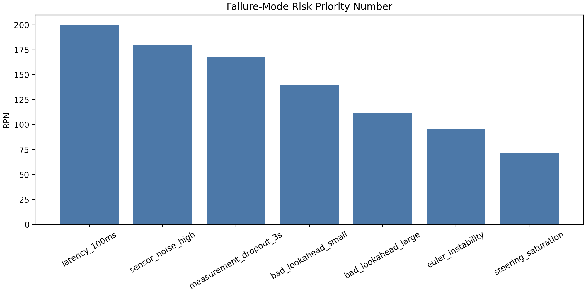
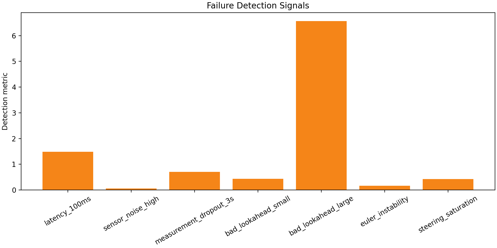

# Failure-Mode FMEA

## Objective

Reproduce controller, estimator, numerical, latency, and actuator failures and document detection signals plus mitigations.

## FMEA Table

| scenario | category | reproduced | detection_signal | severity_1_to_10 | occurrence_1_to_10 | detectability_1_to_10 | rpn | mitigation |
| --- | --- | --- | --- | --- | --- | --- | --- | --- |
| latency_100ms | latency | True | collision at 1.484 s | 8 | 5 | 5 | 200 | Timestamp commands, reduce delay, and add delay compensation. |
| sensor_noise_high | noise | False | EKF high-noise position RMSE 0.053 m | 6 | 6 | 5 | 180 | Tune measurement covariance from sensor specs and reject outliers. |
| measurement_dropout_3s | dropout | True | EKF dropout position RMSE 0.706 m | 7 | 4 | 6 | 168 | Detect stale measurements and slow or stop until updates recover. |
| bad_lookahead_small | controller | True | collision at 0.432 s | 7 | 5 | 4 | 140 | Use the sweep-selected baseline lookahead and steering-effort gates. |
| bad_lookahead_large | controller | True | collision at 6.566 s | 7 | 4 | 4 | 112 | Bound lookahead by map curvature and validate max CTE. |
| euler_instability | numerics | False | no failure, rms CTE=0.166 m | 8 | 4 | 3 | 96 | Use RK4 and keep timestep convergence gates in CI. |
| steering_saturation | actuator | True | command steer dwell at limit 0.419 rad | 8 | 3 | 3 | 72 | Monitor steering limit dwell time and lower speed when saturated. |

## Figures

