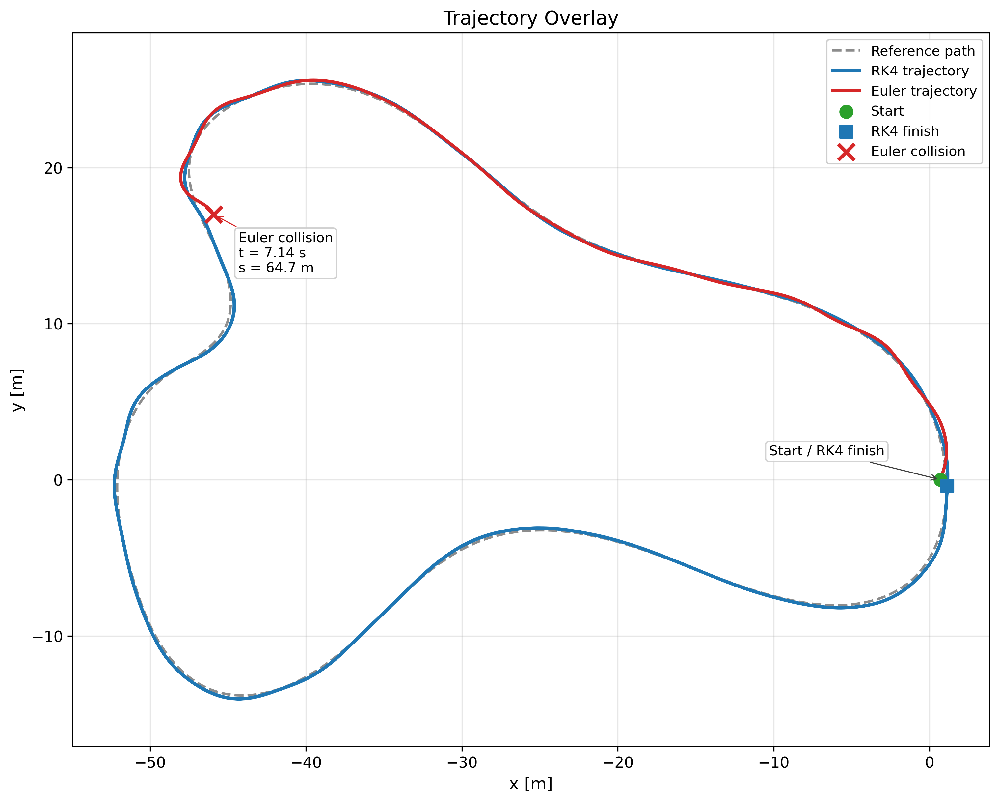
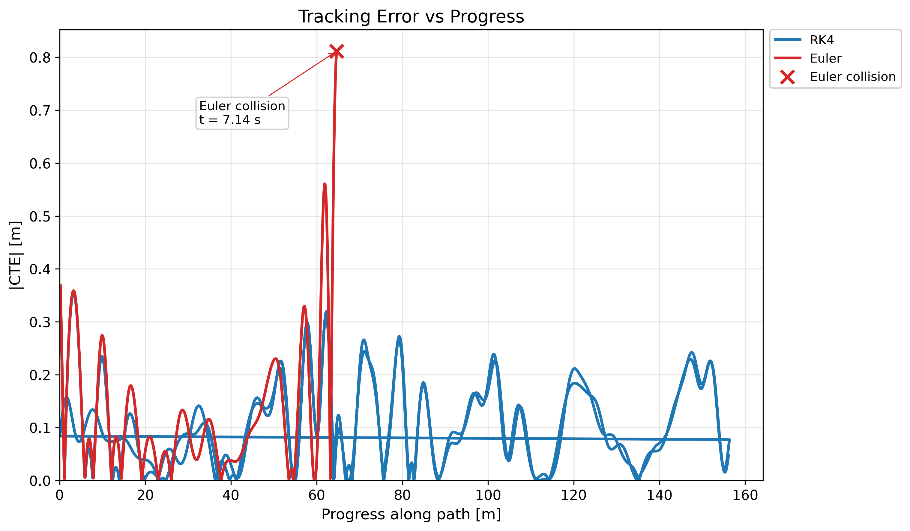
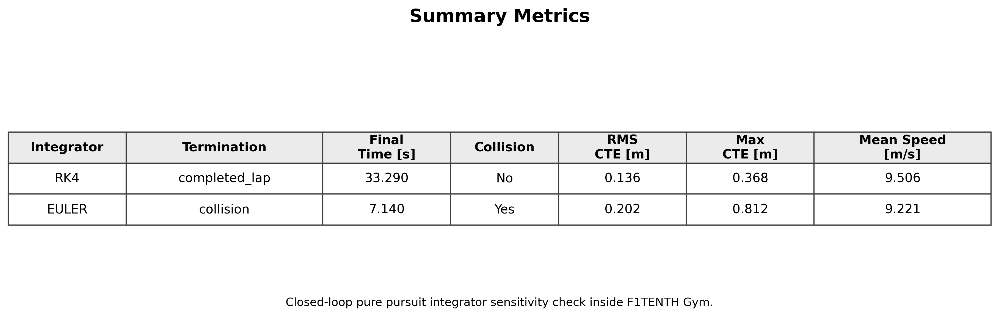

# F1TENTH Gym First Run

## Purpose

This run establishes a reproducible, headless F1TENTH Gym baseline using the existing pure pursuit controller on `examples/example_map`.

This is not yet the derived bicycle-model comparison. The derived-model vs Gym overlay will be added in the next experiment.

## Setup

```bash
conda env create -f environment.yml
conda activate f1tenth-gym
pip install --no-build-isolation --no-deps gym==0.19.0
pip install --force-reinstall "pyglet<1.5"
pip install --no-build-isolation --no-deps -e .
```

## Reproduce

```bash
python experiments/run_scripted_lap.py
python experiments/plot_integrator_comparison.py
python experiments/validate_first_run.py
```

## Artifacts

- Telemetry: `runs/first_lap/telemetry.csv`
- Metadata: `runs/first_lap/metadata.json`
- Trajectory figure: `reports/figures/integrator_trajectory_overlay.png`
- Tracking error figure: `reports/figures/integrator_tracking_error_vs_progress.png`
- Summary metrics figure: `reports/figures/integrator_summary_metrics.png`

### Improved integrator comparison figure







Closed-loop pure pursuit integrator sensitivity check on examples/example_map. RK4 completed one lap, while Euler collided early under the same baseline controller. This figure compares numerical integrator behavior inside F1TENTH Gym and is not a derived bicycle-model comparison.

## First Results

| Integrator | Termination | Lap time (s) | Collision | RMS CTE (m) | Max abs CTE (m) | Mean speed (m/s) |
| --- | --- | ---: | ---: | ---: | ---: | ---: |
| RK4 | completed_lap | 33.29 | 0 | 0.136 | 0.368 | 9.51 |
| Euler | collision | 7.15 | 1 | 0.202 | 0.812 | 9.22 |

## Notes

- The first plot is an integrator sensitivity check: RK4 vs Euler inside the existing F1TENTH Gym plant.
- Telemetry includes command, pose, yaw rate, estimated acceleration, nearest waypoint, progress, CTE, lap state, collision state, and termination reason.
- Later large sweeps should use separate run directories; only `runs/first_lap/` is intended as the frozen first evidence run.
