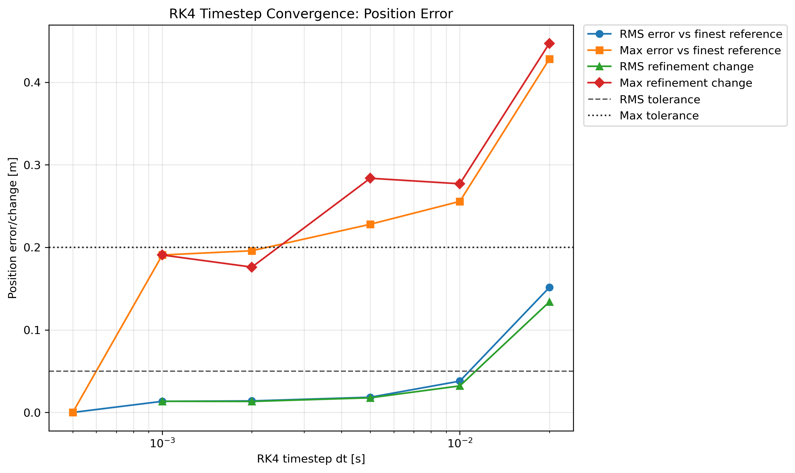
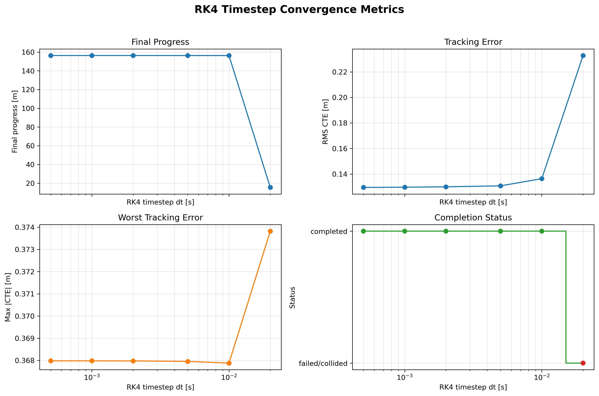

# RK4 Integrator Convergence Study

## Purpose

This study selects a numerically acceptable RK4 timestep for F1TENTH Gym closed-loop pure-pursuit simulations.

This is simulator timestep convergence, not system identification.

## Fixed Experiment Setup

- Integrator: RK4
- Track: examples/example_map
- Waypoints: examples/example_waypoints.csv
- Controller: pure pursuit
- Lookahead: 0.8246188789771397 m
- Velocity gain: 1.375
- Speed behavior: waypoint speed multiplied by velocity gain
- Maximum simulation time: 45.0 s

## Preselected Acceptance Criterion

RK4 timestep is acceptable if the pairwise refinement-change metric satisfies:

- RMS progress-aligned position change < 0.05 m
- max progress-aligned position change < 0.2 m

over the common completed progress range.

This criterion was selected before interpreting the convergence results.

## Timestep Cases

| dt [s] |
|---:|
| 0.0200 |
| 0.0100 |
| 0.0050 |
| 0.0020 |
| 0.0010 |
| 0.0005 |

## Results

| integrator | dt_s | completed_lap | collision | final_time_s | final_progress_m | rms_cte_m | max_abs_cte_m | rms_position_error_vs_ref_progress_m | max_position_error_vs_ref_progress_m | rms_position_error_vs_ref_time_m | max_position_error_vs_ref_time_m | rms_position_change_vs_next_finer_dt_progress_m | max_position_change_vs_next_finer_dt_progress_m | rms_position_change_vs_next_finer_dt_time_m | max_position_change_vs_next_finer_dt_time_m | termination_reason |
| --- | --- | --- | --- | --- | --- | --- | --- | --- | --- | --- | --- | --- | --- | --- | --- | --- |
| rk4 | 0.02 | False | True | 2.24 | 15.4873 | 0.232848 | 0.37382 | 0.151497 | 0.42819 | 0.154409 | 0.346693 | 0.13396 | 0.447167 | 0.103646 | 0.265238 | collision |
| rk4 | 0.01 | True | False | 33.29 | 156.33 | 0.136375 | 0.367882 | 0.0379654 | 0.255683 | 0.234249 | 0.405491 | 0.032166 | 0.277026 | 0.192513 | 0.331497 | completed_lap |
| rk4 | 0.005 | True | False | 33.26 | 156.343 | 0.130737 | 0.367958 | 0.0184313 | 0.227964 | 0.0424273 | 0.0743059 | 0.0177385 | 0.28373 | 0.0264743 | 0.0484435 | completed_lap |
| rk4 | 0.002 | True | False | 33.256 | 156.356 | 0.130005 | 0.367979 | 0.0139756 | 0.195901 | 0.0161001 | 0.0271922 | 0.0133307 | 0.176077 | 0.0111793 | 0.018917 | completed_lap |
| rk4 | 0.001 | True | False | 33.254 | 156.356 | 0.129667 | 0.367982 | 0.0134768 | 0.190743 | 0.00495765 | 0.00845061 | 0.0134768 | 0.190743 | 0.00495765 | 0.00845061 | completed_lap |
| rk4 | 0.0005 | True | False | 33.253 | 156.356 | 0.129509 | 0.367983 | 0 | 0 | 0 | 0 |  |  |  |  | completed_lap |

## Figures

## Selected Timestep

RK4 timestep selected: `dt = 0.0020 s`.

## Interpretation

`dt = 0.01 s`, the original baseline timestep, does not satisfy the preselected refinement criterion.

The progress-aligned refinement-change metric is the decision metric because it compares vehicle position at the same distance along the path. Time-aligned error is included as a secondary diagnostic because it also includes timing and speed-phase differences.

## Limitations

This study only addresses RK4 timestep convergence for the fixed pure-pursuit lap. It does not identify vehicle parameters, tune the controller, or compare against a derived bicycle model.
