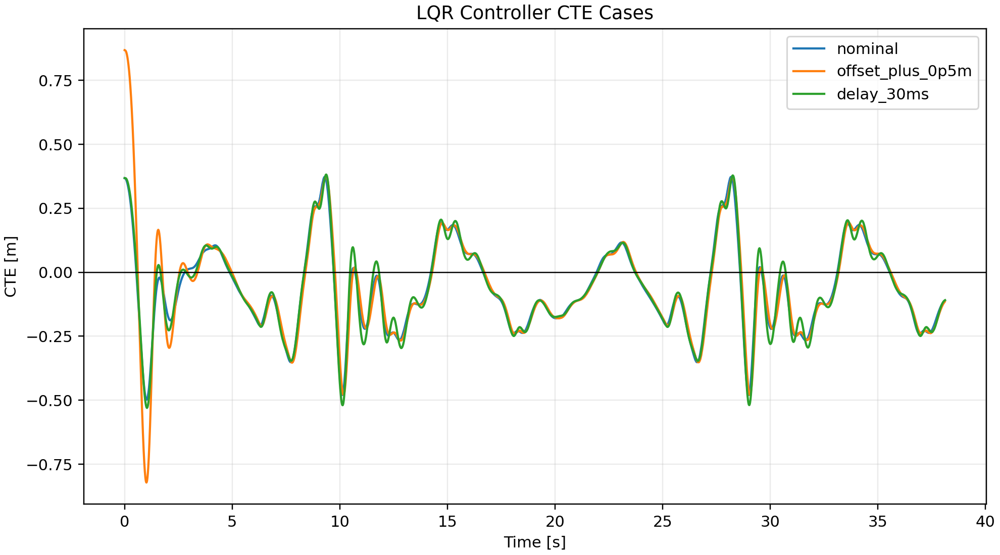

# LQR Controller

## Objective

Design a discrete LQR controller from a local path-error model and compare nominal/off-nominal cases against the tuned pure-pursuit baseline setup.

## Setup

- Integration timestep: `0.002 s`
- Controller update rate: `100 Hz`
- LQR discretization timestep: `0.010 s`
- Operating speed: `8.33095 m/s`
- Operating curvature: `0.0323079 1/m`
- Maximum LQR steering correction: `0.005 rad`
- State: `[cte, heading_error, steer_error, speed_error, yaw_rate_error, slip_angle]`
- Input: `[steering_rate, acceleration]`

## Weights

- `Q = diag([20.0, 12.0, 1.0, 0.5, 2.0, 2.0])`
- `R = diag([2.0, 0.5])`

## Closed-Loop Eigenvalues

Maximum absolute discrete eigenvalue: `0.996291`.

Stable inside unit circle: `True`.

Full matrices and eigenvalues are stored in `runs/lqr_controller/linear_model.json`.

## Case Results

| case | completed | collision | lap time [s] | RMS CTE [m] | max CTE [m] | steering effort [rad] |
| --- | --- | --- | ---: | ---: | ---: | ---: |
| nominal | True | False | 38.064 | 0.178628 | 0.497708 | 8.98777 |
| offset_plus_0p5m | True | False | 38.106 | 0.204509 | 0.86798 | 10.1559 |
| delay_30ms | True | False | 38.122 | 0.183102 | 0.529881 | 11.643 |

## Figure

## Interpretation

This LQR uses the tuned pure-pursuit command as feedforward and applies a small bounded LQR correction on top of it. The nominal, offset, and delayed cases complete, but the tuned pure-pursuit baseline still has lower RMS CTE. Treat this as a first model-based feedback baseline, not a globally optimal controller for every segment of the track.
