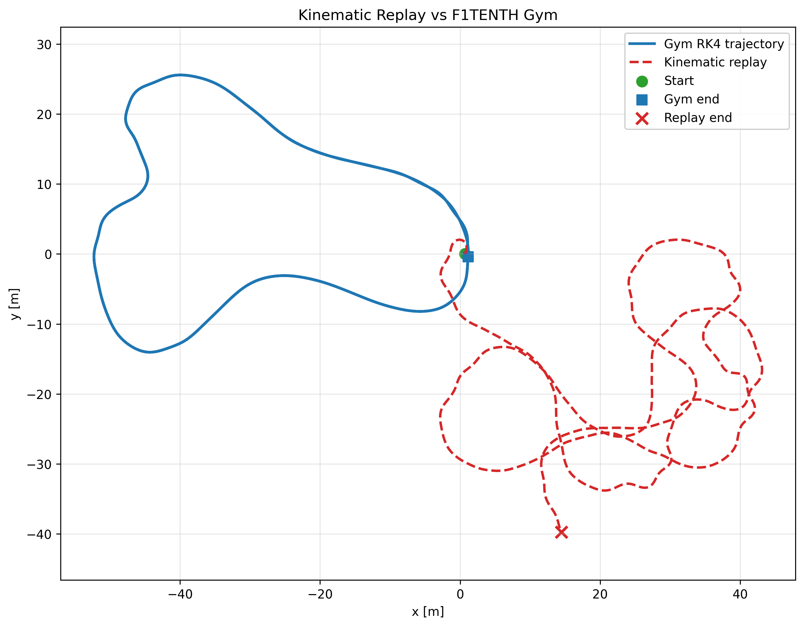
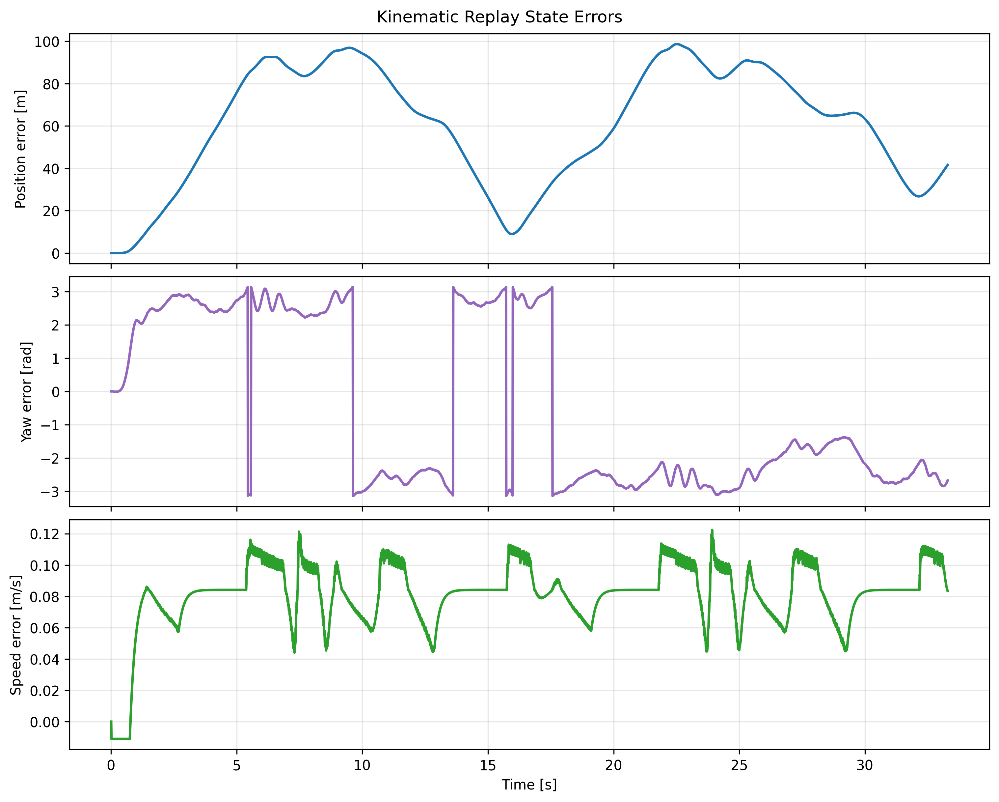
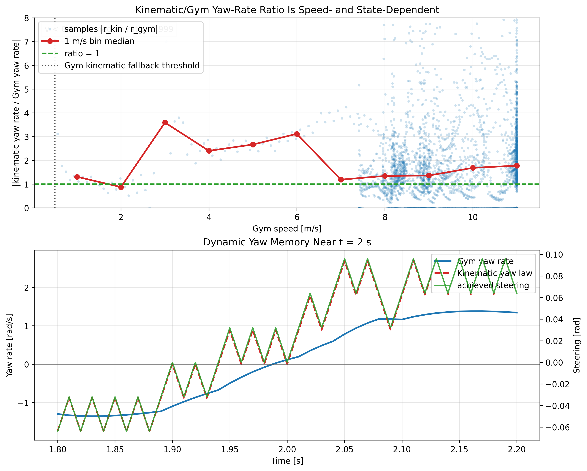

# Kinematic Model vs F1TENTH Gym Replay

## Objective

Replay the existing RK4 F1TENTH Gym telemetry through the documented kinematic bicycle model and quantify how far the model drifts from the Gym trajectory.

## Method

The replay uses the kinematic equations from `docs/vehicle_model.md`:

```text
dX/dt = v cos(psi + beta)
dY/dt = v sin(psi + beta)
dpsi/dt = (v / lr) sin(beta)
dv/dt = a
beta = atan((lr / (lf + lr)) tan(delta))
```

The model is integrated with RK4 over the logged telemetry intervals. Steering input is the achieved simulator steering state `steer_rad`, and acceleration input is `accel_x_mps2`.

## Inputs

- Telemetry: `runs/first_lap/telemetry.csv`
- Integrator filtered: `rk4`
- State initialized from the first RK4 row: `x_m`, `y_m`, `theta_rad`, `speed_mps`
- Geometry: `lf = 0.15875 m`, `lr = 0.17145 m`
- Timestep: `time_s[k+1] - time_s[k]`

## Assumptions

- Gym logs `poses_x`, `poses_y`, and `poses_theta` from the simulator vehicle state. The collision geometry treats that pose as the vehicle body center, so this replay uses the same vehicle-body/CG pose reference.
- Achieved steering `steer_rad` is used instead of `command_steer_rad` to avoid mixing actuator-rate effects into the kinematic model error.
- Acceleration is the logged finite-difference estimate from `speed_mps`.
- Inputs are held constant over each telemetry interval.

## Metrics

| Metric | Value | Units |
| --- | ---: | --- |
| RMSE position | 66.7991 | m |
| Max position error | 98.6618 | m |
| Final position error | 41.5412 | m |
| RMSE yaw | 2.53833 | rad |
| Max abs yaw error | 3.14057 | rad |
| RMSE speed | 0.0841688 | m/s |
| Final speed error | 0.0834373 | m/s |
| Duration replayed | 33.28 | s |
| Number of samples | 3329 | count |

## Timestep Diagnostics

| Metric | Value | Units |
| --- | ---: | --- |
| dt min | 0.01 | s |
| dt max | 0.01 | s |
| dt mean | 0.01 | s |
| dt ratio | 1 | unitless |

## Results

The replay trace is written to `runs/model_vs_gym_comparison/replay_trace.csv`. The metrics are written as a tidy key/value table to `runs/model_vs_gym_comparison/metrics.csv`.

Large drift that grows with speed, steering magnitude, or lateral acceleration is expected evidence of missing tire dynamics in the kinematic model. Drift at low speed and low steering should be treated as a possible sign-convention, geometry, or replay-mapping issue, except during the launch-from-rest regime noted below.

## Closing Diagnostic: Kinematic Yaw-Rate Limitation

The remaining yaw-rate discrepancy is a model-scope limitation, not an open replay bookkeeping bug. Three checks support that conclusion:

- Below `0.5 m/s`, where Gym falls back to its kinematic model, the instantaneous kinematic yaw law matches the Gym yaw-rate signal with median ratio `0.999`. This rules out the main convention, wheelbase, steering-unit, and timestep hypotheses for the replay.
- Above `0.5 m/s`, Gym uses `vehicle_dynamics_st`, and the kinematic/Gym yaw-rate ratio varies with speed and operating condition. The observed 2x-ish average is not a fixed scale bug.
- Near `t = 2.0 s`, the achieved steering passes near zero while Gym still carries nonzero yaw rate. The kinematic model ties yaw rate directly to speed and steering, so it cannot reproduce yaw-rate memory from lateral-yaw dynamics.

This closes the kinematic replay as a structural comparison: the implemented kinematic equations are coherent with Gym in the fallback regime, but the next model comparison must include lateral velocity, slip angle, yaw-rate state, and tire-force dynamics.

## Figures







## Limitations

This comparison tests kinematic model replay against recorded Gym telemetry. It is not parameter identification, not controller design, and not proof that the dynamic bicycle model matches Gym.

The initial launch-from-rest regime (`v ~= 0`) is a low-information zone for the kinematic model; small early offsets there are expected and are not treated as evidence of a convention error.

The kinematic model does not represent tire slip, load transfer, combined slip, steering actuator dynamics, or the full dynamic bicycle model.

## Next Step

Inspect the replay errors before sysID. If the mapping and signs are coherent, the next implementation step is a focused dynamic-model/sysID experiment using explicit excitation and fitted parameters.
