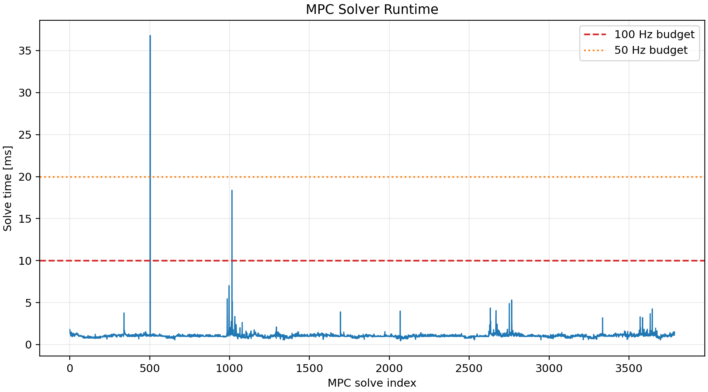
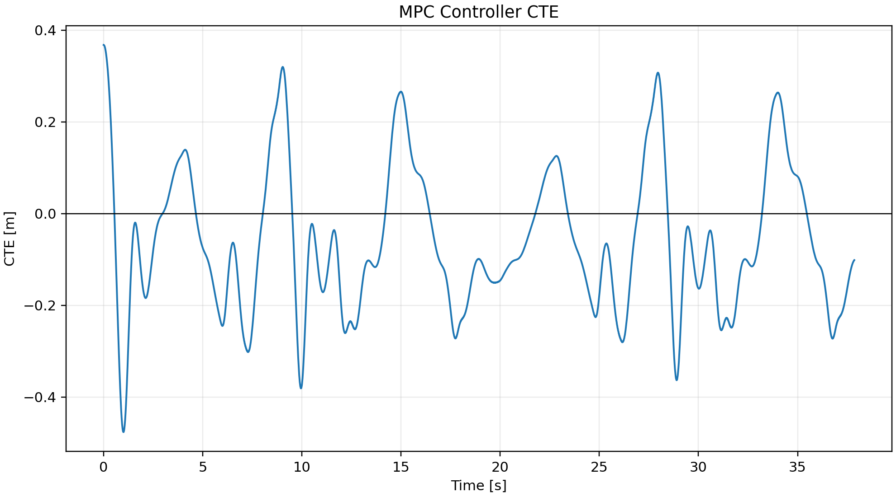

# MPC Controller

## Objective

Evaluate constrained linear MPC using the same 100 Hz control model as LQR and measure solver runtime against real-time budgets.

## Setup

- Integration timestep: `0.002 s`
- Controller update rate: `100 Hz`
- MPC horizon: `15`
- Maximum MPC steering correction: `0.005 rad`
- Feedforward: selected pure-pursuit baseline with bounded MPC correction
- Optimizer: SciPy SLSQP with analytic objective gradient and linear rate constraints
- Steering, steering-rate, and acceleration constraints are pulled from the shared model parameters.

## Result

| Metric | Value |
| --- | ---: |
| Completed lap | True |
| Collision | False |
| Lap/final time | 37.86 s |
| RMS CTE | 0.169238 m |
| Max CTE | 0.47665 m |
| Steering effort | 8.6771 rad |
| Mean solve time | 1.0739 ms |
| p95 solve time | 1.32644 ms |
| Max solve time | 36.8073 ms |
| 100 Hz budget passed | True |
| 50 Hz budget passed | True |

## Figures

## Interpretation

The runtime result is measured evidence for this SciPy/SLSQP implementation. This local run passes the 100 Hz p95 budget, although the maximum solve time can still spike above a single 10 ms control period. A deployment controller should still use a dedicated QP solver, watchdog timing, or a shorter horizon.
