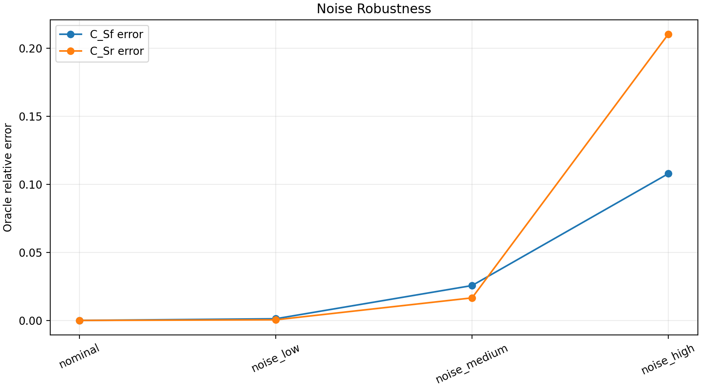
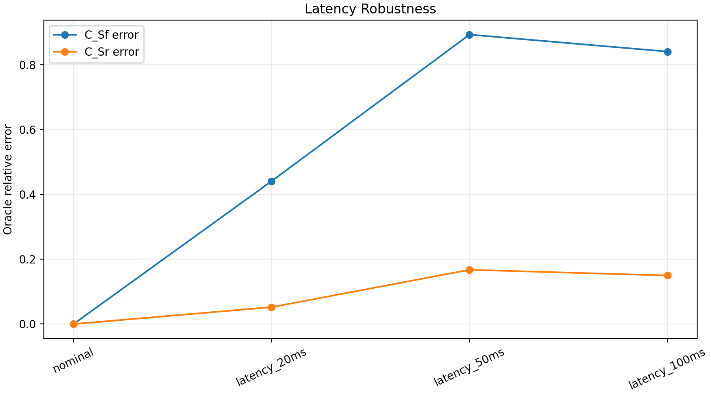
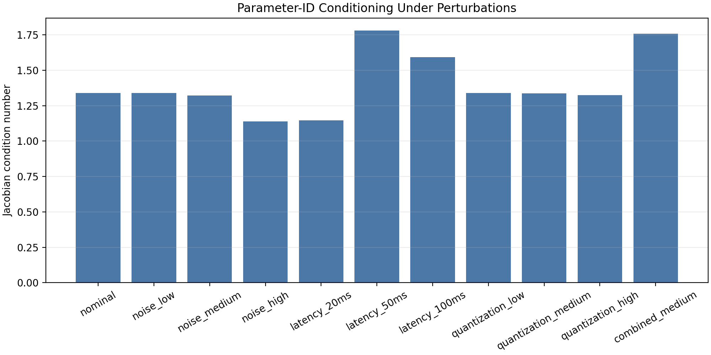

# Parameter-ID Robustness

## Objective

Re-run `C_Sf`/`C_Sr` identification under injected sensor noise, input latency, quantization, and a combined medium perturbation.

## Results

| scenario | kind | fitted_C_Sf | fitted_C_Sr | C_Sf_oracle_relative_error | C_Sr_oracle_relative_error | jacobian_condition_number | acceptance_passed | first_failed_gate |
| --- | --- | --- | --- | --- | --- | --- | --- | --- |
| nominal | nominal | 4.718 | 5.4562 | 5.19743e-10 | 6.52704e-10 | 1.34014 | True |  |
| noise_low | noise | 4.71218 | 5.45865 | 0.00123351 | 0.000449525 | 1.33969 | True |  |
| noise_medium | noise | 4.597 | 5.54669 | 0.0256457 | 0.0165843 | 1.32145 | False | heldout_yaw_rate |
| noise_high | noise | 4.20895 | 6.60441 | 0.107895 | 0.210441 | 1.13771 | False | oracle_recovery |
| latency_20ms | latency | 2.64023 | 5.17179 | 0.440393 | 0.0521266 | 1.14603 | False | oracle_recovery |
| latency_50ms | latency | 0.507641 | 4.544 | 0.892403 | 0.167187 | 1.7794 | False | oracle_recovery |
| latency_100ms | latency | 0.753982 | 4.639 | 0.84019 | 0.149775 | 1.5921 | False | oracle_recovery |
| quantization_low | quantization | 4.72101 | 5.45537 | 0.000637379 | 0.000151857 | 1.34011 | True |  |
| quantization_medium | quantization | 4.71288 | 5.43922 | 0.00108443 | 0.00311237 | 1.33792 | True |  |
| quantization_high | quantization | 4.84796 | 5.37615 | 0.0275448 | 0.0146708 | 1.32463 | False | heldout_yaw_rate |
| combined_medium | combined | 0.532886 | 4.70612 | 0.887053 | 0.137473 | 1.75929 | False | oracle_recovery |

First failed perturbation: `noise_medium` at gate `heldout_yaw_rate`.

## Degradation

| scenario | C_Sf_error_growth_vs_nominal | C_Sr_error_growth_vs_nominal | condition_growth_vs_nominal | heldout_rollout_yaw_rate_rmse | heldout_rollout_slip_angle_rmse |
| --- | --- | --- | --- | --- | --- |
| nominal | 1 | 1 | 1 | 3.02888e-10 | 2.8779e-10 |
| noise_low | 2.3733e+06 | 688712 | 0.999665 | 0.00210408 | 4.29218e-05 |
| noise_medium | 4.93431e+07 | 2.54087e+07 | 0.986056 | 0.0114788 | 0.000249001 |
| noise_high | 2.07592e+08 | 3.22414e+08 | 0.84895 | 0.0431019 | 0.00091723 |
| latency_20ms | 8.47328e+08 | 7.98625e+07 | 0.855158 | 0.0718157 | 0.00342765 |
| latency_50ms | 1.71701e+09 | 2.56145e+08 | 1.32777 | 0.170573 | 0.00821007 |
| latency_100ms | 1.61655e+09 | 2.29469e+08 | 1.18801 | 0.248809 | 0.0114424 |
| quantization_low | 1.22633e+06 | 232658 | 0.999974 | 0.000278133 | 1.65609e-06 |
| quantization_medium | 2.08647e+06 | 4.76843e+06 | 0.998341 | 0.00151983 | 1.63151e-05 |
| quantization_high | 5.29969e+07 | 2.24769e+07 | 0.988428 | 0.0129632 | 0.000588315 |
| combined_medium | 1.70671e+09 | 2.10621e+08 | 1.31277 | 0.175204 | 0.00839565 |

## Acceptance Gates

| scenario | gate_oracle_recovery | gate_heldout_yaw_rate | gate_heldout_slip_angle | gate_heldout_yaw | gate_heldout_normalized_fit | gate_heldout_variance_accounted_for | gate_identifiability |
| --- | --- | --- | --- | --- | --- | --- | --- |
| nominal | True | True | True | True | True | True | True |
| noise_low | True | True | True | True | True | True | True |
| noise_medium | True | False | True | False | True | True | True |
| noise_high | False | False | True | False | True | False | True |
| latency_20ms | False | False | False | True | False | False | True |
| latency_50ms | False | False | False | False | False | False | True |
| latency_100ms | False | False | False | False | False | False | True |
| quantization_low | True | True | True | True | True | True | True |
| quantization_medium | True | True | True | True | True | True | True |
| quantization_high | True | False | True | False | True | True | True |
| combined_medium | False | False | False | False | False | False | True |

## Figures

