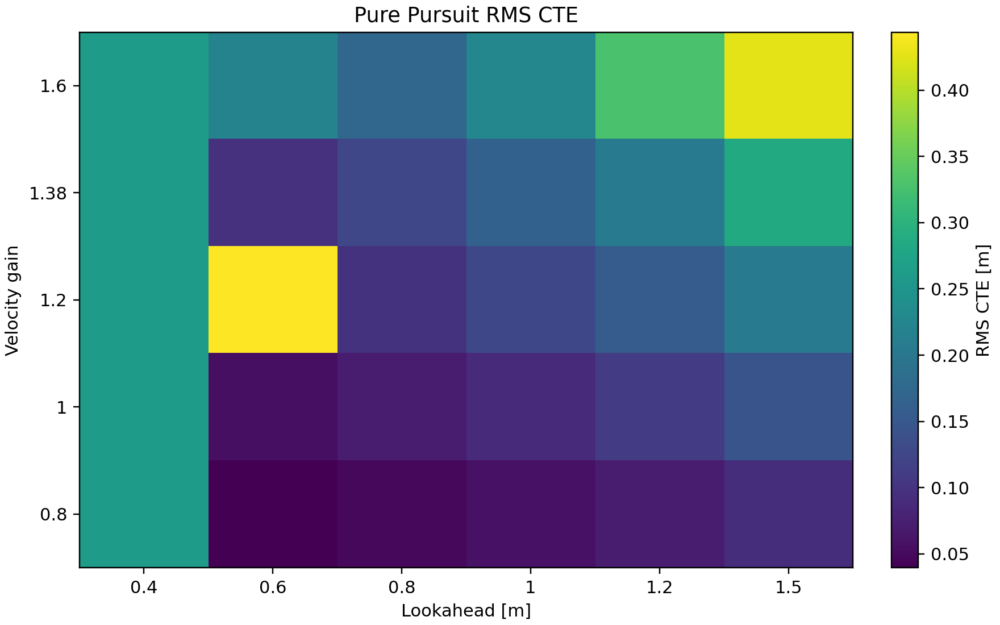
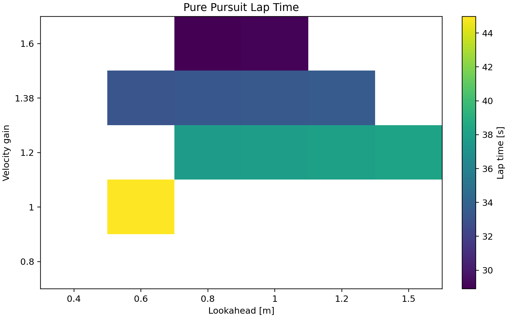
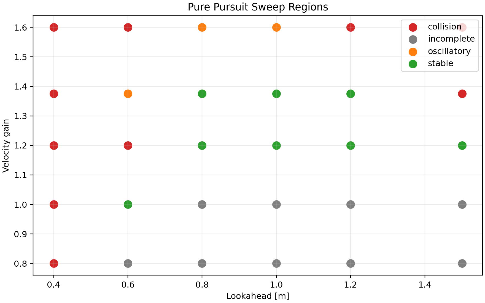

# Pure Pursuit Sweep

## Objective

Tune pure pursuit over lookahead and velocity gain before comparing against LQR and MPC.

## Setup

- Integrator: RK4
- Integration timestep: `0.002 s`
- Controller update rate: `100 Hz`
- Command hold: zero-order hold between controller updates
- Track: `examples/example_map`
- Lookahead values: `[0.4, 0.6, 0.8, 1.0, 1.2, 1.5]`
- Velocity gains: `[0.8, 1.0, 1.2, 1.375, 1.6]`

## Recommended Baseline

Recommended baseline: **lookahead = 1.200 m, vgain = 1.200**.

Reason: this run completed without collision and had the lowest weighted score among stable candidates.

| Metric | Value |
| --- | ---: |
| Lap time | 38.042 s |
| RMS CTE | 0.157892 m |
| Max CTE | 0.403062 m |
| Steering effort | 8.19853 rad |
| Weighted score | 0.668584 |

## Top Completed Runs

| lookahead_m | vgain | lap_time_s | rms_cte_m | max_abs_cte_m | steering_effort_rad | weighted_score | classification |
| --- | --- | --- | --- | --- | --- | --- | --- |
| 1.2 | 1.2 | 38.042 | 0.157892 | 0.403062 | 8.19853 | 0.668584 | stable |
| 1.5 | 1.2 | 38.216 | 0.206472 | 0.487029 | 6.99299 | 0.677879 | stable |
| 1 | 1.2 | 37.928 | 0.127334 | 0.36798 | 10.4543 | 0.742044 | stable |
| 1.2 | 1.375 | 33.504 | 0.205956 | 0.510443 | 11.7676 | 0.921946 | stable |
| 0.8 | 1.2 | 37.82 | 0.0986543 | 0.36798 | 17.4812 | 1.06471 | stable |
| 1 | 1.375 | 33.374 | 0.165826 | 0.414591 | 17.0947 | 1.12421 | stable |
| 0.6 | 1 | 44.986 | 0.0559593 | 0.36798 | 21.5057 | 1.22324 | stable |
| 0.8 | 1.375 | 33.244 | 0.126354 | 0.367979 | 27.1321 | 1.57495 | stable |

## Classification Rules

Priority order: collision, incomplete, corner cutting, oscillatory, stable.

- Corner cutting threshold: max CTE > `0.800 m`
- Oscillatory threshold: steering effort above the completed-run 75th percentile
- Weighted score: `rms_cte + 0.25 * max_cte + 0.05 * steering_effort`

These thresholds are map-specific heuristics intended to select a controller baseline, not universal stability criteria.

## Figures

## Outputs

- `runs/pure_pursuit_sweep/results.csv`
- `runs/pure_pursuit_sweep/metadata.json`
