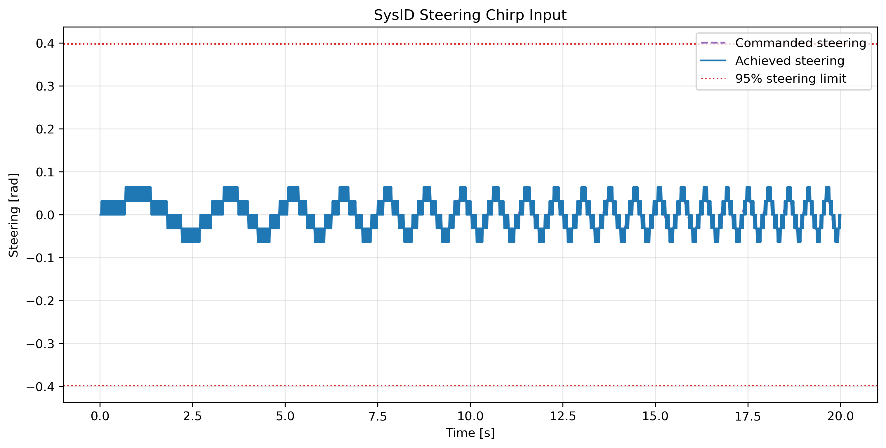
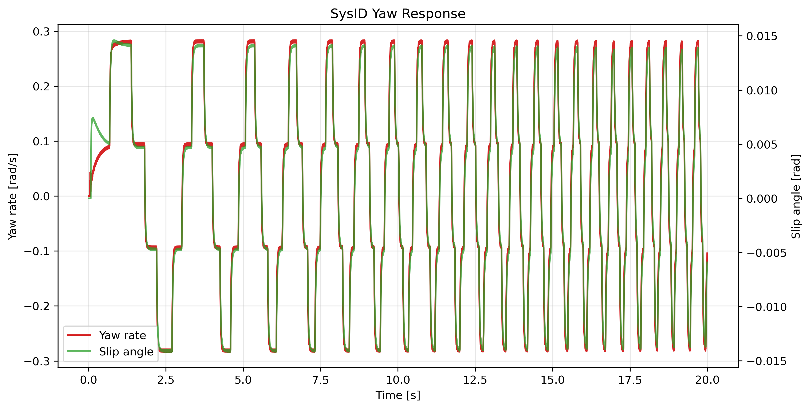
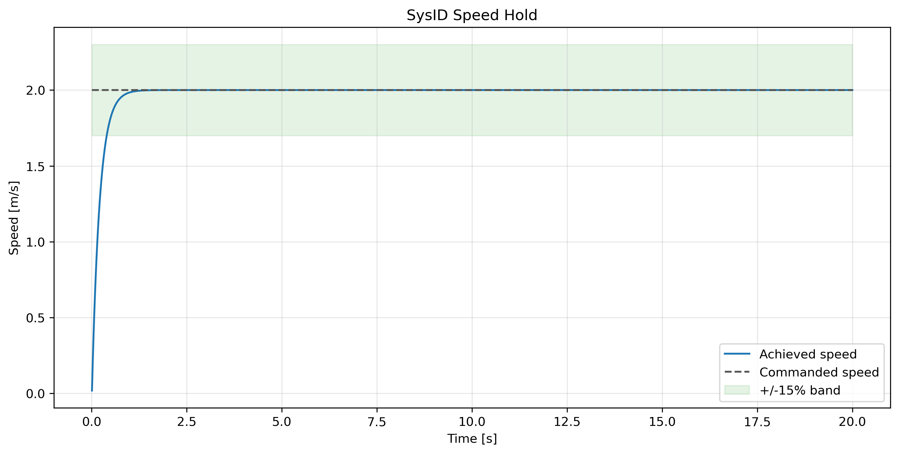

# SysID Steering Excitation

## Objective

Collect a clean lateral-yaw excitation dataset for later tire-stiffness identification. This branch performs no parameter fitting.

## Method

The experiment uses F1TENTH Gym RK4 on a generated open occupancy map with a speed-hold command and zero-centered chirp steering. This is not pure pursuit feedback. The selected profile has chirp amplitude `0.040 rad`, target speed `2.000 m/s`, and duration `20.000 s`.

Environment commands are not the same as internal dynamic-model input. `command_steer_rad` and `command_speed_mps` are setpoints passed to `env.step`; future sysID should use achieved/reconstructed signals: `steer_rad`, `steer_vel_radps`, `speed_mps`, and `accel_x_mps2`.

## Logged State

Telemetry logs internal dynamic state from `env.sim.agents[0].state`, including achieved steering, speed, yaw rate, and slip angle. The lateral/longitudinal body velocity components are derived as `vx_mps = speed_mps * cos(slip_angle_rad)` and `vy_mps = speed_mps * sin(slip_angle_rad)`.

## Quality Gates

Quality status: `passed`.

| Metric | Value | Units | Pass |
| --- | ---: | --- | --- |
| duration_s | 19.99 | s | True |
| num_samples | 2000 | count | True |
| collision | 0 | bool | True |
| speed_mean_mps | 1.97917 | m/s | True |
| speed_std_mps | 0.143914 | m/s | True |
| speed_cv | 0.0727145 | unitless | True |
| steer_range_rad | 0.128 | rad | True |
| yaw_rate_range_radps | 0.567181 | rad/s | True |
| steering_saturation_fraction | 0 | fraction | True |
| max_saturation_segment_s | 0 | s | True |

## Results

- Duration: `19.990 s`
- Steering range: `0.1280 rad`
- Yaw-rate range: `0.5672 rad/s`
- Speed coefficient of variation: `0.0727`

## Figures

## Limitations

This branch collects excitation data only; no `C_Sf` or `C_Sr` fitting is performed. Fitting starts only after excitation quality passes and the telemetry mapping is accepted.

## Next Step

If the quality gates pass, create a separate fitting branch to estimate `C_Sf` and `C_Sr` and compare fitted values against Gym defaults.
